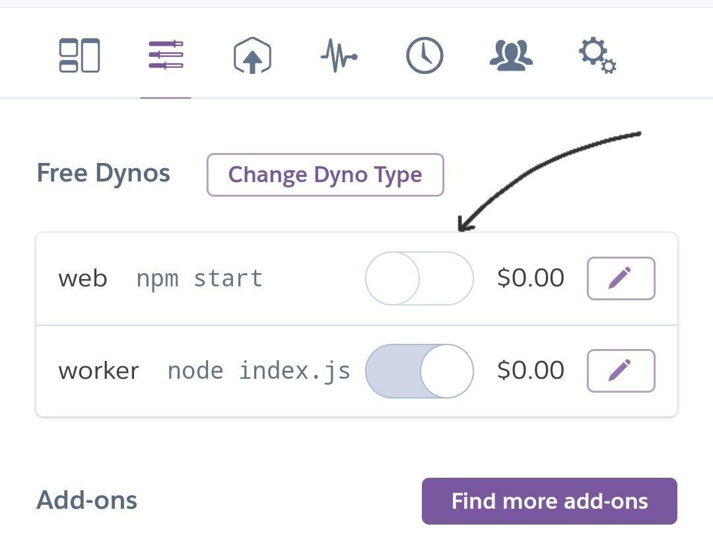
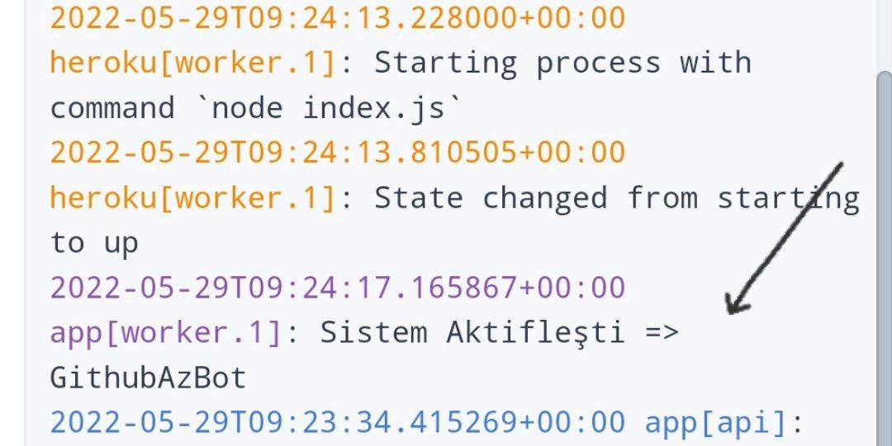

<div id="top"></div>


<!-- PROJE LOGO -->
<br />

### 🔹 Kolay Heroku Kurulum
  
[](https://heroku.com/deploy?template=https://github.com/mertece9/oyun)  
 <i>Deploy Sonrası Yapılması Gerekenler:</i><br/>
      <i>web npm start butonu kapatın</i><br/>
     <br/>
      <i>Logda Aktif Gözücektir</i><br/>
      <br/>

### ⭐️ Linux Server Kurulum

1. Reponu Klonlayın
   ```sh
   git clone https://github.com/mertece9/oyun
   cd oyun
   ```
2. Telegraf,Environment Paketleri İndirin
   ```sh 
   npm install telegraf && npm install dotenv
   ```
3. `nano .env` Komutunu Kullanarak .env Dosyasını Düzenleyin
   ```.env
   TOKEN= Botun Tokeni Yazın @BotFather
   ID_BOT= Botun ID Yazın (İlk Rakamlar)
   BOT_ISMI= Botun Kullanıcı Adını '@' Olmadan Yazın
   RAUND_SAYI= RAUND SAYISI (3-5) İdeal aralık 
   SANIYE= Resimlerin Değişmesi Süresi / 10000=10 Saniye
   
    ```
4. Botu Başlatın.
   ```
   node botTesla.js
    ```

## Resim

- [ ] `resimler` Klasörüne resmi ekleyin. Resim İsmi İlk olarak belirtiğiniz rakamı yazın <br/>
- Örnek: `21_resim.jpg`
- Ve Bot Resimlerden Random Olarak Seçicektir


